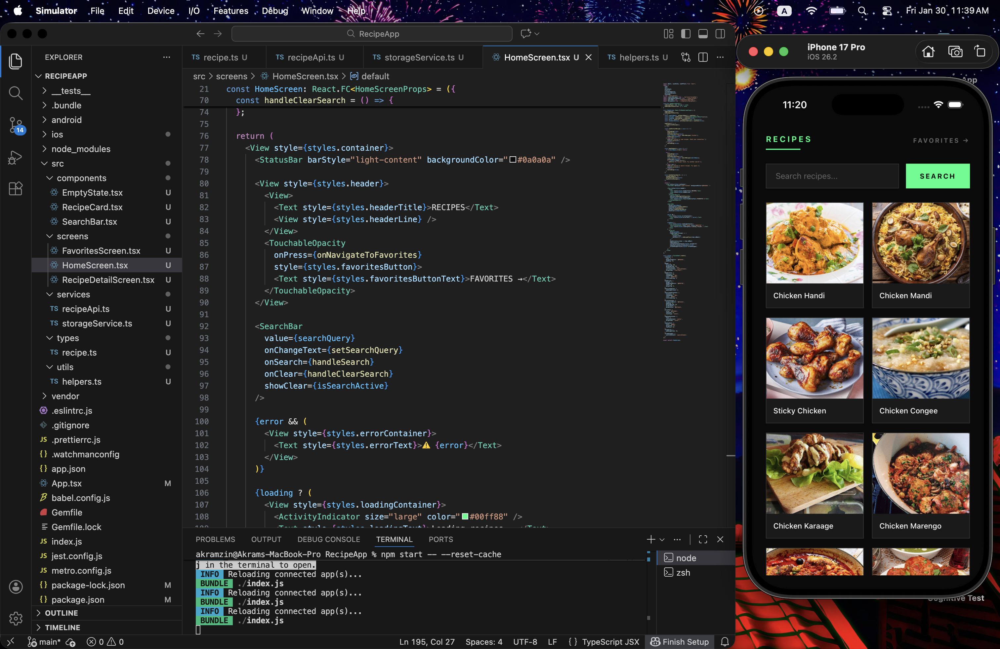
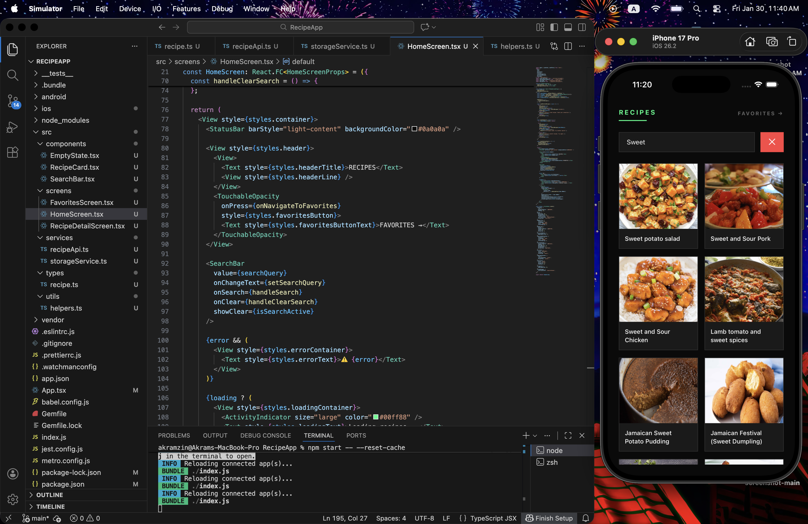
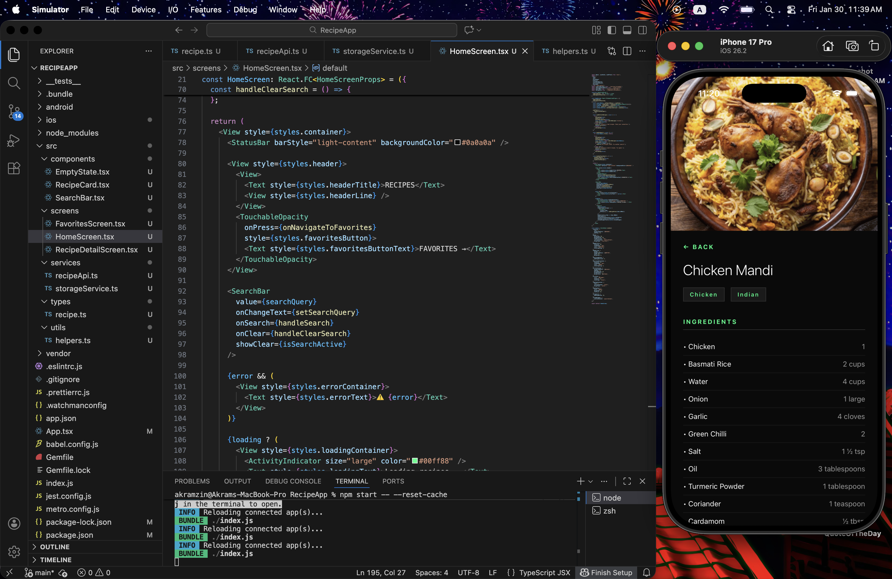
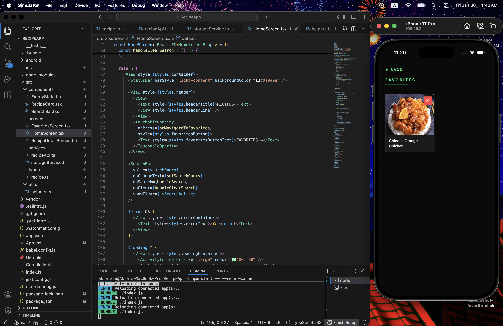

# 🍳 Recipe App - React Native

A modern recipe discovery app built with React Native featuring search, favorites, and a Gen Z minimalist aesthetic.

## ✨ Features

- 🔍 **Search Recipes** - Search thousands of recipes using TheMealDB API
- 📖 **Recipe Details** - View ingredients, instructions, and categories
- ❤️ **Favorites** - Save and manage your favorite recipes
- 🎨 **Gen Z Minimalist UI** - Clean black background with neon green accents
- 💾 **Persistent Storage** - Favorites saved locally with AsyncStorage
- ✕ **Clear Search** - Quickly reset to browse all recipes
- 🔄 **Smart Navigation** - Proper back navigation from any screen

## 📸 Screenshots

### Home Screen


### Search Results


### Recipe Detail


### Favorites


## 🛠️ Tech Stack

- **React Native** (without Expo)
- **TypeScript**
- **TheMealDB API** - Free recipe API
- **AsyncStorage** - Local data persistence
- **React Hooks** - State management
- **Reusable Components** - Clean architecture

## 📦 Installation

### Prerequisites
- Node.js
- React Native CLI
- Xcode (for iOS)
- CocoaPods

### Setup

1. Clone the repository:
```bash
git clone https://github.com/akramzin/RecipeApp-ReactNative.git
cd RecipeApp-ReactNative
```

2. Install dependencies:
```bash
npm install
```

3. Install iOS dependencies:
```bash
cd ios
pod install
cd ..
```

4. Run the app:

**iOS:**
```bash
npm run ios
```

**Android:**
```bash
npm run android
```

## 📁 Project Structure
```
RecipeApp/
├── src/
│   ├── components/
│   │   ├── RecipeCard.tsx       # Reusable recipe card
│   │   ├── SearchBar.tsx        # Search input component
│   │   └── EmptyState.tsx       # Empty state component
│   ├── screens/
│   │   ├── HomeScreen.tsx       # Main search & browse screen
│   │   ├── RecipeDetailScreen.tsx  # Recipe details
│   │   └── FavoritesScreen.tsx  # Saved favorites
│   ├── services/
│   │   ├── recipeApi.ts         # API service
│   │   └── storageService.ts    # AsyncStorage operations
│   ├── types/
│   │   └── recipe.ts            # TypeScript interfaces
│   └── utils/
│       └── helpers.ts           # Utility functions
├── App.tsx                       # Main app with navigation
└── README.md
```

## 🎨 Design Philosophy

This app follows a **Gen Z minimalist aesthetic**:
- **Color Palette**: Pure black (#0a0a0a) with neon green (#00ff88) accents
- **Typography**: Clean, modern fonts with strategic weight variations
- **Layout**: Grid-based recipe cards with generous spacing
- **Interactions**: Smooth transitions and intuitive navigation

## 🚀 Features Breakdown

### Search & Browse
- Search recipes by name or ingredient
- Clear search to return to default view
- Grid layout with recipe thumbnails
- Loading states and error handling

### Recipe Details
- Full recipe information
- Ingredient list with measurements
- Step-by-step instructions
- Category and cuisine tags
- Large hero image

### Favorites System
- One-tap save to favorites
- Persistent storage using AsyncStorage
- Remove favorites with confirmation
- Empty state for no favorites
- Quick access from any screen

### Navigation
- Smart back button navigation
- Context-aware routing (returns to previous screen)
- Clean transitions between screens

## 🌐 API

This app uses the [TheMealDB API](https://www.themealdb.com/api.php) - a free recipe database with:
- 1000+ recipes
- Multiple cuisines
- Detailed ingredients
- No API key required

## 📝 Future Enhancements

- [ ] Filter by category/cuisine
- [ ] Ingredient-based search
- [ ] Cooking timer
- [ ] Share recipes
- [ ] Meal planning calendar
- [ ] Shopping list generator
- [ ] Video tutorials integration
- [ ] Dark/Light theme toggle
- [ ] Offline recipe viewing

## 👨‍💻 Author

**Akramzin**
- GitHub: [@akramzin](https://github.com/akramzin)

## 📄 License

This project is open source and available under the MIT License.

## 🙏 Acknowledgments

- Recipe data provided by [TheMealDB](https://www.themealdb.com/)
